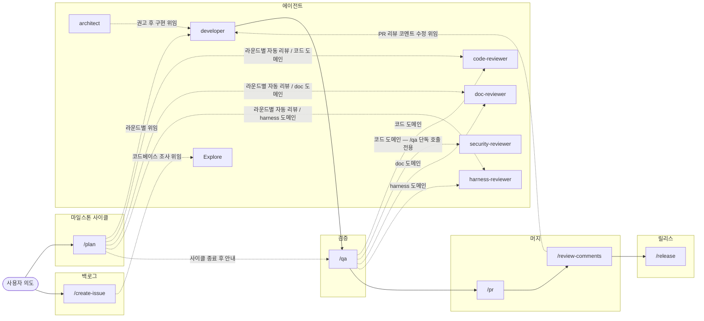

# Claude Code Harness 흐름도

이 문서는 두 가지 역할을 합니다: **(1) 하네스 흐름도** 와 **(2) 여러 reviewer·skill 이 공유하는 cross-cutting 정의의 단일 권위** (Reviewer 라우팅 / 공통 분류 등급 / 검증 명령 실행 책임 / 본문 작성 가이드). 개별 skill·agent 의 상세 동작은 각 SKILL.md / agent frontmatter 가 권위입니다.

이 하네스는 공유 SSOT 저장소에서 각 프로젝트 `.claude/` 로 배포(vendoring)됩니다. **배포본은 생성물이므로 직접 수정하지 않습니다** — SSOT 에서 고친 뒤 다시 배포하세요. 배포 도구와 그 방식을 택한 이유는 SSOT 저장소의 README 가 권위입니다.

---

## Skill Pipeline (SDLC 흐름도)

> 도메인별 라우팅 권위는 아래 "Reviewer 라우팅" 표 — caller (`/qa` 등) 가 변경 파일을 입력 도메인으로 분기.

---

## Reviewer 라우팅

**Reviewer 라우팅의 단일 권위**. 다른 SKILL/agent 본문은 본 표만 참조합니다.

변경 파일을 입력 도메인으로 분기 — caller(`/qa`, developer self-round, `/review-comments` 등) 가 동등하게 참조하는 단일 권위.

| 입력 도메인 | Reviewer | 상태 |
|---|---|---|
| 프로젝트 toolchain 입력 코드 | `code-reviewer` | 활성 |
| 프로젝트 toolchain 입력 코드 | `security-reviewer` | 활성 * |
| 사용자/외부 독자 향 문서 (`**/*.md` 중 `.claude/**` 외 — 예: `docs/**/*.md`, 루트 + 영역별 `CLAUDE.md`, 기타 `README.md`) | `doc-reviewer` | 활성 |
| 하네스 자산 (`.claude/**/*.md` — 예: `.claude/agents/*.md`, `.claude/skills/**`, `.claude/README.md`, `.claude/required-docs.md`) | `harness-reviewer` | 활성 |

> \* `security-reviewer` 의 `/plan` 루프 제외 등 호출시점 정책은 `.claude/skills/qa/SKILL.md` "/plan 자동 iteration 과의 책임 경계" 표 참조.

> **코드 도메인 정의**: "프로젝트 toolchain 입력 코드" 의 구체 확장자는 영역별 `CLAUDE.md` 또는 `docs/development.md` 의 lint/typecheck/test 명령 대상이 권위. toolchain 외 파일 (이미지/lock/data 등) 의 처리는 아래 "도메인 외 입력 정책" 참조.

**입력 도메인**은 분할 (한 파일은 정확히 한 도메인). 각 도메인에 reviewer 는 1+ 개 라우팅 가능.

**도메인 외 입력 정책**: caller 가 어떤 이유로든 도메인 외 파일을 reviewer 입력에 포함한 경우, 해당 reviewer 는 그 파일에 대해 "분류 외 — 본 에이전트 영역 아님" 으로 보고만 하고 검증을 수행하지 않습니다.

**매칭 절차** (caller 공통):
1. `git diff --name-only` (또는 caller 가 명시한 범위) 로 변경 파일 수집.
2. 각 파일을 위 표의 glob 과 매칭.
3. 매칭된 reviewer(들)를 Agent 도구로 호출. 다중 도메인 매칭 시 reviewer 들을 같은 응답 내 병렬 호출.

---

## 검증 명령 실행 책임

- `<typecheck-cmd>` / `<test-cmd>` / `<lint-cmd>` / `<build-cmd>` 등 toolchain 검증 명령의 **실행**은 caller(오케스트레이션 레이어: `/qa`, `/plan` 등)가 bash로 수행.
- reviewer 에이전트(code-reviewer, security-reviewer 등)는 검증 명령을 직접 실행하지 않고 코드 리뷰만 수행. 실행 결과(P0)는 caller가 종합.
- 구체 명령의 권위 = `docs/development.md` 또는 영역별 `CLAUDE.md`.

**2층 검증 모델**: developer self-gate(깨진 상태로 넘기지 않기 위한 완료 조건) ↔ caller 결합 판정(병렬 위임·공유파일 변경 시의 P0 권위 결정)은 역할이 다르며 독립적으로 운영된다. `/plan` Step 4b-1의 조건부 skip 규칙 상세는 `plan/SKILL.md` 가 권위.

---

## 공통 분류 등급

모든 reviewer 와 `/qa` 스킬은 findings 를 다음 3등급으로 분류합니다 — 단일 권위.

- **`P0`** — 머지 차단. 정확성 / 보안 / 빌드·테스트·lint 실패 / 명세 권위 위반 등.
- **`P1`** — 권장 개선. 차단은 아니지만 머지 전 가능하면 해결.
- **`P2`** — 사소한 제안. 톤·표현·미세한 보완.

각 reviewer 의 위반 키 → 등급 매핑은 reviewer 본문 참조.

---

## Decision 참조 검증 (adr-content-mismatch 공통 절차)

`doc-reviewer` 와 `harness-reviewer` 가 공유하는 `adr-content-mismatch` 검증 알고리즘. 각 reviewer 는 아래 절차를 따르되, **read 대상 파일과 검출 도메인만 자기 영역을 채운다**.

1. 정규식 `Decision (#?\d+(?:-\d+)?)` 으로 변경 .md 본문에서 Decision 참조 검출 — 레거시 순번(`Decision 76`)과 신규 이슈 식별자(`Decision #992`)를 모두 잡고, 캡처 그룹은 `#` 를 포함한다.
2. 참조가 1개 이상 발견된 경우에만 `<read-target>` 을 read (조건부 — 참조 없으면 read 불필요).
3. 각 참조마다:
   - **존재성**: `<read-target>` 에 `## Decision <참조 식별자>` 헤더 존재하는가 (`#` 접두 포함해 그대로 대조 — 신규는 `## Decision #992`). 없으면 **P0** (`존재하지 않는 Decision`).
   - **맥락 정합성**: 참조한 본문 단락이 해당 Decision 본문의 결정·이유·결과·트레이드오프 중 하나와 의미적으로 연결되는가. 무관하면 **P1** (`맥락 부적합 — 의도된 Decision 추정 또는 인용 제거 권장`).
   - **부분 연결** (Decision 본문의 부수 문장과 일치하지만 핵심과 거리감): false positive 회피 차원에서 `adr-content-mismatch` 로 잡지 않음.
4. 다중 참조 (`Decision 2 / Decision 8` 처럼) 시 각 Decision 독립 판정. 하나라도 맥락 불일치면 어느 N 이 문제인지 명시.
5. **검출 범위**: 각 reviewer 의 입력 도메인 안에서만 검출 (도메인 외는 분류 외로 처리).

**reviewer 별 변수**:

| reviewer | read-target | 검출 도메인 |
|---|---|---|
| `doc-reviewer` | `docs/architecture-decisions.md` | `**/*.md` 중 `.claude/**` 외 |
| `harness-reviewer` | `docs/harness-decisions.md` + `docs/architecture-decisions.md` (양쪽) | `.claude/**/*.md` |

---

## 호출 방식

모든 스킬은 명시 호출 전용입니다 (자동 호출 스킬 없음).

## 본문 작성 가이드 — 진입 금지 도메인 키워드

이 하네스(`.claude/`) 본문에 들어가면 안 되는 도메인 키워드. 새 agent/skill 작성 또는 기존 파일 수정 시 참조.

- **영역별 경로** — 예: `docs/`, `src/lib/`, `src/components/`, `src/app/api/` 등 프로젝트 종속 경로. 대신 "영역별 `CLAUDE.md`" / "프로젝트 디렉토리" 등으로 일반화.
- **빌드/검증 명령어** — 프로젝트 스택 종속 명령 (`pnpm test:run`, `pnpm typecheck`, `pnpm lint`, `pnpm db:push`, `pnpm build` 등). 대신 "테스트 명령", "typecheck 명령", "lint 명령" 등 역할 표현 + "구체 명령은 `docs/development.md` 또는 영역별 `CLAUDE.md` 권위" 위임.
- **외부 의존 스택** — 사용 중인 ORM / 큐 / 인증 / 빌드 도구 이름 (예: Next.js, Drizzle, shadcn, Vitest, Biome). 대신 역할 표현 ("DB 마이그레이션 명령", "테스트 러너", "린터").
- **도메인 / 비즈니스 용어** — 프로젝트 이름, 핵심 도메인명, 표준 에러 클래스명 등. 대신 "이 프로젝트" / "프로젝트의 표준 에러 패턴" 등.
- **정책 수치** — 라벨 목록, 구체 버전 패턴 등 프로젝트마다 달라지는 값.
- **하네스 카운트 표현** — "N종" / "N가지" 같이 하네스 안의 검증 단계 / 서브에이전트 / 도구 등을 정량 카운트하는 표현. 하네스 변경마다 본문 동기화 부담이 누적되고, 의미가 다른 카운트끼리 숫자 충돌이 발생함. 대신 항목 나열 / 역할 표현 ("다중 검증" / "bash 명령 + Agent 호출" 등). 외부 표준·스펙이 정한 고정 항목 수는 예외. 과거 Decision 스냅샷(`docs/harness-decisions.md` / `docs/architecture-decisions.md` 본문) 은 본 규칙의 적용 대상이 아니다.

**판정 휴리스틱**: 임의의 다른 프로젝트에 그대로 들어가도 의미가 동일한가? → No 면 금지.

---

## 본문 작성 가이드 — 성능 안티패턴

이 하네스 자산(`.claude/`) 본문 작성 시 LLM 호출 비용·속도에 부정적 영향을 주는 패턴. 작성·수정 시 사전 점검 기준. reviewer (`harness-reviewer`) 가 검출하는 `perf-anti-pattern` sub-category 와 1:1 매칭.

- **자연어 비중 과다** — CLI 명령으로 정형화 가능한데 자연어로 길게 적힌 절차.
  - 안티: "변경된 .md 를 도메인별로 분리해서 reviewer 에 전달..."
  - 권고: `git diff $RANGE --name-only -- '*.md' | grep '^\.claude/' > /tmp/...` 같은 ready-to-run 명령.
- **자동 로드 자산 명시 read** — 루트 / 영역별 `CLAUDE.md` 같이 자동 로드되는 자산을 "필수 read" 로 적지 않음. agent 호출 시 이미 컨텍스트에 있음.
- **불필요 권위 read** — agent 의 검증 키 / 동작에 활용되지 않는 권위 문서를 "필수 read" 로 적지 않음. 활용처가 명확한 부분만 read. 무분별 풀 전체 본문 read 가 안티패턴.
- **agent 호출 정당성 부족** — 단순 grep / 파일 매칭은 메인 세션 또는 bash 로 처리. 하위 agent 호출은 큰 분석 영역 (R&R / 정합성) 에 한정.
- **출력 길이 미명시** — agent 호출 시 결과 형식 (인용 길이, 분류 등) 명시. 자유 형식 회피.

**판정 휴리스틱**: 이 패턴으로 작성하면 LLM 호출 토큰 ↑ 또는 속도 ↓ 되는가? → Yes 면 안티패턴.

**예외 — reviewer 의도된 cross-doc read**: cross-doc 검증이 목적인 reviewer 의 tiered loading(Tier 0 인덱스 전체 + 조건부 Tier 2 후보 본문) 준수 read 는 "불필요 권위 read" 안티패턴이 아니다.

**예외 (의도된 자연어)**: `conceptual` kind 권위 문서 (PHILOSOPHY.md, design.md 등) 는 사람 가독성이 본질. 자연어 비중 과다는 그쪽에서는 안티패턴 아님 — 본 가이드는 하네스 (`.claude/`) 본문에만 적용.

---

## 하네스 철학

→ [harness-rules.md](./harness-rules.md) § "철학" 참조.

## 권위 문서 frontmatter 표준

권위 문서 (`.claude/**/*.md`, `docs/**/*.md` 중 frontmatter 있는 것) 의 frontmatter 스키마 (`role` / `kind` / `non_goals`) 는 [required-docs.md](./required-docs.md#frontmatter-스키마) 가 SSOT.
